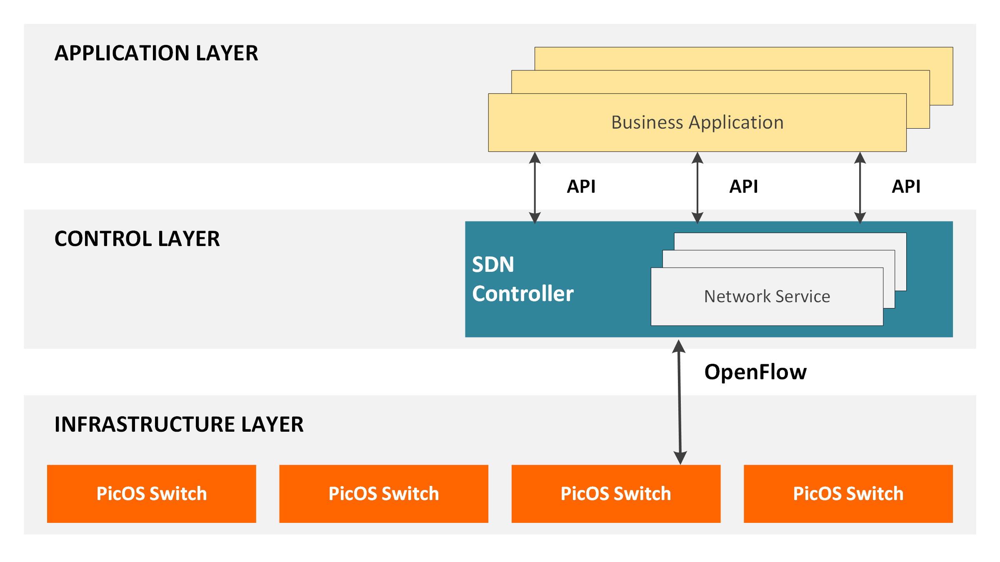

# Mininet
Mininet is a network *emulator* (no, not a simulator) that can aid the creation of an entire virtual network-- replete with hosts, switches, controllers, and links. Mininet primarily serves to bolster research and prototyping in the realm of Software Defined Networking (SDN) as it supports Linux based OpenFlow switches, flexibile routing, custom topologies and much more. And the best part is it's almost entirely written in __*Python*__.

#### Advantages of Mininet
The advanatges of Mininet are many and I've directly copied my favourite from the Mininet homepage:
- Provides a simple and inexpensive network testbed for developing OpenFlow applications
- Enables complex topology testing, without the need to wire up a physical network
- Provides a straightforward and extensible Python API for network creation and experimentation
- Boots faster: seconds instead of minutes
- Scales larger: hundreds of hosts and switches vs. single digits
- Provides more bandwidth: typically 2Gbps total bandwidth on modest hardware

I touched upon way too many things without adequate explanation in the previous paragraph, but we will get to them soon (OpenFlow, SDN, emulators, etc.) enough. Also, while we will plumb the depths of SDN and OpenFlow, we will not be discussing how Mininet works under the hood. It builds on something called Linux network namespaces, and to some extent Linux Containers (or LXCs - also what powers Docker). However, to completely discuss these will be the job of another post, some other day.

## So what exactly is an Emulator?
Well, an emulator is something which exactly *replicates* the working of a device, and uses processes or abstractions that are inherently used by the original device. A simulator only *models* these processes, and tries to model the original device based on some assumptions. Both have their pros and cons and there is no reason to consider one to always be superior than the other.

## OpenFlow and SDN
Software Defined Networking relates to being able to control the forwarding plane of the network by instantiating controllers as a central authority, capable of handling and relaying information to switches/routers sitting below it as well as networking applications sitting above it. The controller is able to do this through *southbound APIs* for the switches and *northbound APIs* for the business logic/applications. OpenFlow is just a (in fact, the first) standard for SDN. Moreover, OpenFlow allows for the remote handling of a Layer-3 switch's packet forwarding tables. This allows for dynamic routing by the addition or removal of packet matching rules by the controller. Most networking companies (Corsa, Cisco, Alcatel, Huawei among others) have OpenFlow enabled switches in production and there are a number of OpenFlow controllers a few of which are Floodlight (Java based) and POX (Python based). A visual diagram of the SDN setup is shown below.

## Our aim for today

## Recapitulating
Mininet is a great tool for research and development for SDN and OpenFlow and with this post we saw how to emulate a network topology and observe its behaviour. In future posts, we will be looking at more involved aspects of Mininet and Software Defined Networking with OpenFlow. Stay tuned and keep being awesome!
